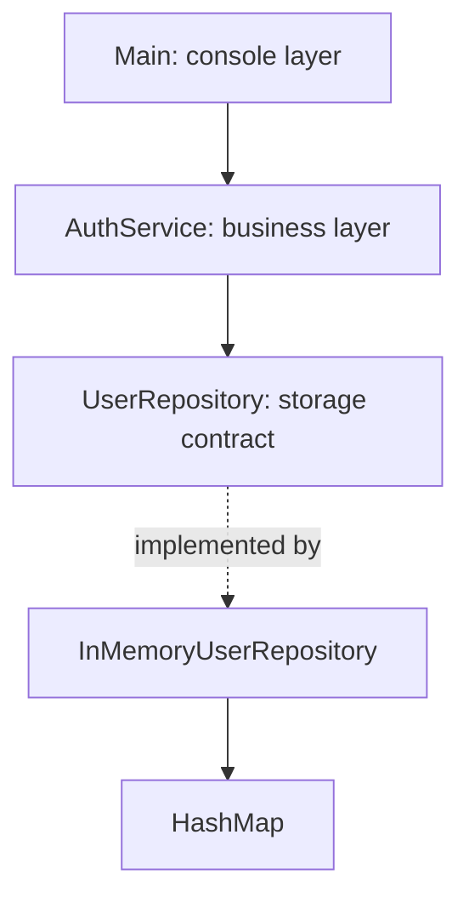

# 🔐 Java Authentication Fundamentals


A small console authentication application built with pure Java.

The purpose of this project is to understand the Java concepts required before moving to Spring Boot. Instead of letting Spring create and connect our objects automatically, we first implement everything manually.

---

## 🎯 Project objectives

The application currently supports:

- Registering multiple users
- Validating email and password
- Preventing duplicate email registration
- Logging in with email and password
- Listing registered users
- Storing users temporarily in memory
- Separating console, business, and storage responsibilities

This project introduces the same layered architecture we will later use with Spring Boot.

---

## 🏗️ Current architecture



Each layer has a specific responsibility:

| Component | Responsibility |
|---|---|
| `Main` | Reads input and displays output |
| `AuthService` | Handles registration and login rules |
| `UserRepository` | Defines available storage operations |
| `InMemoryUserRepository` | Stores users in a `HashMap` |
| `User` | Represents and protects user information |

---

## 📁 Project structure

```text
java-auth-basics/
├── src/
│   ├── Main.java
│   ├── User.java
│   ├── AuthService.java
│   ├── UserRepository.java
│   └── InMemoryUserRepository.java
└── out/
    └── Compiled .class files
```

The `src` directory contains source code.

The `out` directory is generated during compilation and contains Java bytecode.

---

# 📚 Java concepts learned

## 1. Java entry point

Every console application begins with:

```java
public static void main(String[] args)
```

- `public`: the JVM must be able to access the method.
- `static`: Java can call it without creating a `Main` object.
- `void`: the method does not return a value.
- `String[] args`: contains command-line arguments.

---

## 2. Variables and data types

Variables store values:

```java
boolean running = true;
String choice = scanner.nextLine();
User user = null;
```

Examples of types used in this project:

| Type | Purpose |
|---|---|
| `boolean` | Stores `true` or `false` |
| `int` | Stores whole numbers |
| `String` | Stores text |
| `User` | Stores a reference to a `User` object |
| `Map<String, User>` | Associates emails with users |
| `List<User>` | Contains multiple users |

---

## 3. Console input with `Scanner`

We use `Scanner` to read information entered by the user:

```java
Scanner scanner = new Scanner(System.in);

String email = scanner.nextLine();
```

`System.in` represents the standard input stream, normally the keyboard.

The scanner is closed when the application stops:

```java
scanner.close();
```

---

## 4. Loops and `switch`

The application continues running while `running` is `true`:

```java
while (running) {
    // Display menu and process the selected option
}
```

The selected menu option is handled with `switch`:

```java
switch (choice) {
    case "1" -> register(scanner, authService);
    case "2" -> login(scanner, authService);
    case "3" -> listUsers(authService);
    case "4" -> running = false;
    default -> System.out.println("Invalid option.");
}
```

The arrow-style `switch` avoids accidental fall-through between cases.

---

## 5. Methods

Methods divide a program into smaller responsibilities:

```java
private static void printMenu() {
    System.out.println("1. Register");
    System.out.println("2. Login");
}
```

A method declaration can contain:

```text
access modifier + static/non-static + return type + name + parameters
```

Example:

```java
private static void login(
    Scanner scanner,
    AuthService authService
)
```

- `private`: only `Main` can call the method.
- `static`: it belongs to the `Main` class.
- `void`: it returns no value.
- `scanner` and `authService`: method parameters.

---

# 👤 Classes and objects

## Class

A class is a blueprint:

```java
public class User {
    // Fields, constructor and methods
}
```

## Object

An object is an instance created from a class:

```java
User user = new User(
    "alice@example.com",
    "Secret123"
);
```

- `User` is the variable type.
- `user` is the variable name.
- `new` creates an object.
- `User(...)` calls the constructor.

Every user object has its own state.

---

## Constructor

A constructor initializes an object:

```java
public User(String email, String password) {
    this.email = email;
    this.password = password;
}
```

The constructor:

- Has the same name as its class
- Has no return type
- Runs when `new` is used
- Initializes the object’s fields

The keyword `this` refers to the current object:

```java
this.email = email;
```

- `this.email` is the object’s field.
- `email` is the constructor parameter.

---

# 🔒 Encapsulation

Encapsulation protects an object’s internal state.

User fields are private:

```java
private final String email;
private final String password;
```

Code outside `User` cannot directly access them:

```java
// Not allowed
user.password;
```

Instead, the class provides controlled behavior:

```java
public String getEmail() {
    return email;
}

public boolean hasPassword(String enteredPassword) {
    return password.equals(enteredPassword);
}
```

The application can verify a password without exposing the stored password.

---

## Access modifiers

| Modifier | Accessible from |
|---|---|
| `public` | Anywhere |
| `protected` | Same package and subclasses |
| No modifier | Same package |
| `private` | Same class only |

---

## The `final` keyword

```java
private final UserRepository userRepository;
```

A `final` field can be assigned only once.

It prevents replacing the reference:

```java
// Not allowed after initialization
this.userRepository = anotherRepository;
```

However, it does not make the referenced object immutable. We can still call:

```java
userRepository.save(user);
```

---

# ✅ User validation

The `User` constructor prevents invalid objects from being created.

Examples of validation:

```java
if (email == null || email.isBlank()) {
    throw new IllegalArgumentException(
        "Email cannot be empty."
    );
}
```

```java
if (password == null || password.length() < 8) {
    throw new IllegalArgumentException(
        "Password must contain at least 8 characters."
    );
}
```

The email is normalized before storage:

```java
String normalizedEmail = email
    .trim()
    .toLowerCase(Locale.ROOT);
```

For example:

```text
"  ALICE@EXAMPLE.COM  "
```

becomes:

```text
"alice@example.com"
```

---

## Short-circuit operators

The `||` operator means “or”:

```java
email == null || email.isBlank()
```

If the first condition is `true`, Java does not evaluate the second condition. This prevents calling `isBlank()` on `null`.

The `&&` operator means “and”:

```java
user != null && user.hasPassword(password)
```

If `user != null` is false, Java does not call `hasPassword()`. This prevents a `NullPointerException`.

---

# 📦 Collections and generics

The application stores users in:

```java
Map<String, User> usersByEmail = new HashMap<>();
```

A `Map` stores key-value associations:

| Key | Value |
|---|---|
| Email address | `User` object |

Example:

```java
usersByEmail.put(user.getEmail(), user);
```

Finding a user:

```java
User user = usersByEmail.get(email);
```

Checking whether an email exists:

```java
usersByEmail.containsKey(email);
```

---

## Important collection types

| Collection | Description |
|---|---|
| `List` | Ordered elements; duplicates allowed |
| `Set` | Unique elements |
| `Map` | Key-value associations |

---

## Generics

The declaration:

```java
Map<String, User>
```

means:

- Keys must be `String` objects.
- Values must be `User` objects.

Generics provide compile-time type safety:

```java
// Valid
usersByEmail.put("alice@example.com", user);

// Compilation error: key is not a String
usersByEmail.put(10, user);
```

The diamond operator allows Java to infer the generic types:

```java
Map<String, User> usersByEmail = new HashMap<>();
```

---

## Useful `Map` operations

| Method | Description |
|---|---|
| `put(key, value)` | Adds or replaces an entry |
| `get(key)` | Finds a value using its key |
| `containsKey(key)` | Checks whether a key exists |
| `remove(key)` | Removes an entry |
| `size()` | Returns the number of entries |
| `isEmpty()` | Checks whether the map is empty |
| `values()` | Returns all values |
| `keySet()` | Returns all keys |

`HashMap` operations such as `put`, `get`, and `containsKey` are normally approximately \(O(1)\).

---

# 🔌 Interfaces and implementations

The repository interface defines a storage contract:

```java
public interface UserRepository {

    void save(User user);

    User findByEmail(String email);

    boolean existsByEmail(String email);

    List<User> findAll();
}
```

An interface says what must be done, but not how it is done.

The implementation decides how users are stored:

```java
public class InMemoryUserRepository
    implements UserRepository {
}
```

The class must implement every abstract method declared by the interface.

---

## `@Override`

```java
@Override
public void save(User user) {
    usersByEmail.put(user.getEmail(), user);
}
```

`@Override` tells the compiler that the method implements a method from a parent type.

It helps Java detect spelling mistakes and incorrect method signatures.

---

## Interface reference and concrete object

```java
UserRepository userRepository =
    new InMemoryUserRepository();
```

| Part | Meaning |
|---|---|
| `UserRepository` | Reference type and contract |
| `userRepository` | Variable name |
| `InMemoryUserRepository` | Concrete implementation |
| `new` | Creates the implementation object |

We cannot instantiate an interface directly:

```java
// Invalid
new UserRepository();
```

We must create a class that implements it.

---

## Polymorphism

Because the variable uses the interface type, implementations can be exchanged:

```java
UserRepository repository =
    new InMemoryUserRepository();
```

Later:

```java
UserRepository repository =
    new JdbcUserRepository();
```

`AuthService` does not need to change because it depends on the `UserRepository` contract.

---

# 🗄️ Repository layer

`InMemoryUserRepository` stores users inside a private `HashMap`:

```java
private final Map<String, User> usersByEmail =
    new HashMap<>();
```

Its responsibilities include:

- Saving users
- Finding users by email
- Checking whether an email exists
- Returning all users

The repository does not decide whether registration should be allowed. That is a business rule belonging to `AuthService`.

---

## Defensive copy

The repository returns users with:

```java
return new ArrayList<>(usersByEmail.values());
```

This creates a new list instead of exposing the repository’s internal collection directly.

Clearing the returned list:

```java
repository.findAll().clear();
```

does not clear the internal `HashMap`.

This technique is called a defensive copy.

---

# 🧠 Service layer

`AuthService` contains authentication use cases and business rules:

```java
public class AuthService {

    private final UserRepository userRepository;

    public AuthService(UserRepository userRepository) {
        this.userRepository = Objects.requireNonNull(
            userRepository,
            "UserRepository cannot be null."
        );
    }
}
```

Current service operations:

```java
register(email, password)
login(email, password)
findAllUsers()
```

The service decides:

- Whether an email can be registered
- When a user should be saved
- Whether login credentials are correct

---

## Constructor injection

The repository is supplied through the service constructor:

```java
UserRepository userRepository =
    new InMemoryUserRepository();

AuthService authService =
    new AuthService(userRepository);
```

This is called constructor injection.

Benefits include:

- Dependencies are explicit.
- Dependencies cannot be forgotten.
- Implementations can be replaced.
- The service is easier to test.
- Business logic does not depend directly on `HashMap`.

---

## Composition versus inheritance

`AuthService` has a repository:

```java
private final UserRepository userRepository;
```

This is composition: a “has-a” relationship.

`AuthService` should not extend the repository:

```java
// Incorrect design
public class AuthService
    extends InMemoryUserRepository {
}
```

That would suggest that an authentication service is a repository, which is not true.

---

# 🔄 Registration flow

Registration currently follows these steps:

1. `Main` reads the email and password.
2. `Main` calls `authService.register(...)`.
3. `AuthService` creates a `User`.
4. The `User` constructor validates and normalizes the data.
5. `AuthService` asks the repository whether the email exists.
6. The repository searches its `HashMap`.
7. If the email is available, the repository saves the user.
8. `AuthService` reports success or failure.
9. `Main` displays the result.

Key service logic:

```java
public boolean register(String email, String password) {
    User user = new User(email, password);

    if (userRepository.existsByEmail(user.getEmail())) {
        return false;
    }

    userRepository.save(user);
    return true;
}
```

---

# 🔑 Login flow

Login follows these steps:

1. `Main` reads the credentials.
2. `Main` calls `authService.login(...)`.
3. `AuthService` asks the repository for the email.
4. The repository normalizes the email and searches the map.
5. The `User` verifies the password.
6. The authenticated user is returned when both values match.
7. Otherwise, login fails.

Key service logic:

```java
public User login(String email, String password) {
    User user = userRepository.findByEmail(email);

    if (user != null && user.hasPassword(password)) {
        return user;
    }

    return null;
}
```

The application deliberately displays the same failure message for an unknown email and an incorrect password:

```text
Invalid email or password.
```

This avoids revealing which email addresses are registered.

---

# ☕ Java passes arguments by value

Java always passes arguments by value.

For objects, the copied value is a reference to the object.

When the repository is passed to `AuthService`, both variables reference the same repository object:

```java
AuthService authService =
    new AuthService(userRepository);
```

Therefore, users saved through `AuthService` appear in the same repository used throughout the application.

Creating a new repository for every operation would create separate empty `HashMap` objects and lose access to previously registered users.

---

# ▶️ Compile and run

Compile every Java source file:

```bash
javac -d out src/*.java
```

- `javac` runs the Java compiler.
- `-d out` places compiled `.class` files inside `out`.
- `src/*.java` selects every Java source file in `src`.

Run the application:

```bash
java -cp out Main
```

- `java` starts the JVM.
- `-cp` means classpath.
- `out` tells Java where compiled classes are located.
- `Main` is the class containing `main()`.

---

## Example menu

```text
Welcome to Java Auth

1. Register
2. Login
3. List users
4. Exit
Choose an option:
```

---

# 🌱 Connection to Spring Boot

Our pure Java architecture already resembles a Spring Boot application:

| Pure Java project | Spring Boot equivalent |
|---|---|
| Console methods in `Main` | REST controller |
| `AuthService` | `@Service` |
| `UserRepository` | Spring Data repository |
| `InMemoryUserRepository` | Spring-generated implementation |
| `HashMap` | MySQL database |
| Console input | Angular HTTP request |
| Console output | HTTP response |
| Manual object creation | Spring IoC container |
| Manual constructor injection | Spring dependency injection |

Today, we manually create and connect objects:

```java
UserRepository repository =
    new InMemoryUserRepository();

AuthService authService =
    new AuthService(repository);
```

Later, Spring will create and connect these objects automatically.

This is why a Spring service can use a repository interface: Spring creates a runtime implementation and injects its object into the service.

---

# ⚠️ Current limitations

This is an educational application and is not ready for production.

Current limitations:

- Passwords are stored as plain text.
- Users disappear when the application stops.
- Email validation is intentionally simple.
- Login currently uses `null` to indicate failure.
- Registration currently uses `boolean` for its result.
- There are no automated tests.
- There is no database.
- There is no web API or Angular interface.

Never store real passwords as plain text in a production application.

---

# 🗺️ Learning roadmap

Completed:

- [x] Variables and basic types
- [x] Methods and parameters
- [x] Loops and `switch`
- [x] Classes and objects
- [x] Constructors and `this`
- [x] Encapsulation
- [x] Access modifiers
- [x] `final`
- [x] Basic validation
- [x] Basic exception handling
- [x] Collections
- [x] Generics
- [x] `Map` and `HashMap`
- [x] Interfaces and implementations
- [x] Polymorphism
- [x] Repository layer
- [x] Service layer
- [x] Composition
- [x] Constructor injection
- [x] Separation of concerns

Coming next:

- [ ] Custom exceptions
- [ ] Checked versus unchecked exceptions
- [ ] Records and enums
- [ ] `Optional`
- [ ] Lambdas and streams
- [ ] Secure password hashing
- [ ] Maven project structure
- [ ] JUnit testing
- [ ] Mockito
- [ ] JDBC
- [ ] MySQL storage
- [ ] Spring Boot migration
- [ ] Angular registration and login interface

---

## 🚀 Final goal

The final goal is to transform this console application into a full-stack authentication project:

```text
Angular
   ↓ HTTP/JSON
Spring Boot REST API
   ↓
AuthService
   ↓
UserRepository
   ↓
MySQL
```

By building the Java foundation first, Spring annotations and automatic dependency injection will be easier to understand instead of feeling like magic.